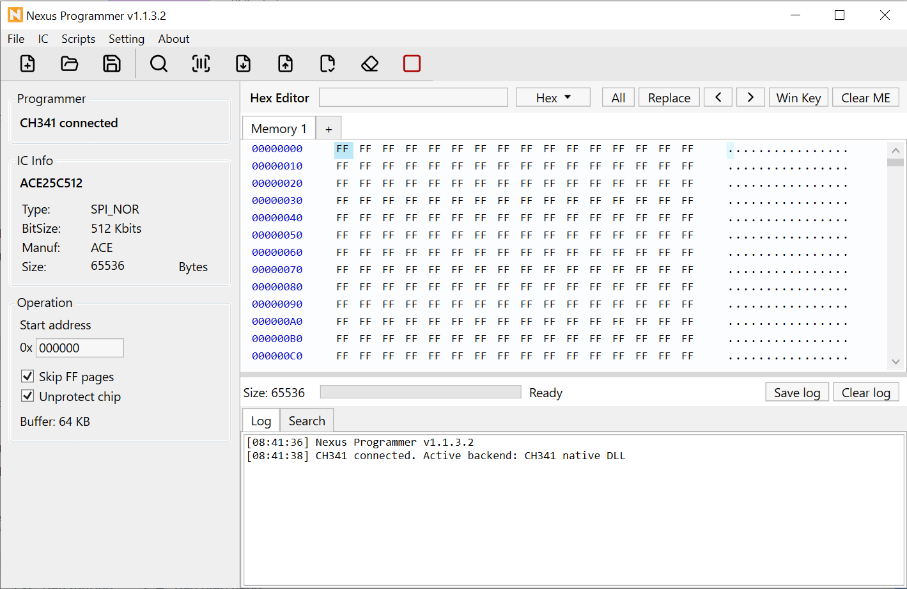
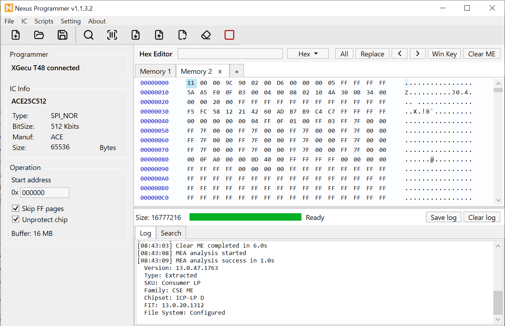

# Nexus Programmer

|                                               |                                                 |
| --------------------------------------------- | ----------------------------------------------- |
|     |       |
|  |  |

## English

English | [Tiếng Việt](#tiếng-việt)

Nexus Programmer is a Windows utility app for CH341/CH347 and XGecu T48. It focuses on SPI NOR flash chips. It can detect a programmer, detect/search/select SPI NOR chips, read/write/verify buffers and erase chips

## Features

- CH341, CH347, and XGecu T48 programmer detection
- SPI NOR catalog search with JEDEC ID matching, add new chips if not found
- Separate SPI NOR catalogs for CH341/CH347 and XGecu T48
- Hex buffer preview/editor
- Read, write, verify, erase, and script workflows
- Light/dark mode

## Requirements

- Windows 10/11
- .NET 8
- Driver WCH CH341/CH347 👉 [CH34XPAR.zip](Programmers/CH34x/CH34XPAR.zip)
- Driver XGecu WinUSB 👉 [T48DRIVER.zip](Programmers/XGecuT48/T48DRIVER.zip)

## Download

You can download the latest release from the [GitHub releases page](https://github.com/mhqb365/NexusProgrammer/releases)

## License

MIT License

Parts of the CH341/CH347 SPI NOR catalog are generated from flashrom chip definitions and remain
subject to the flashrom GPL-2.0-or-later license. See `THIRD_PARTY_NOTICES.md`
and `flashrom-data/COPYING.rst`

## Tiếng Việt

[English](#english) | Tiếng Việt

Nexus Programmer là ứng dụng Windows dành cho CH341/CH347 và XGecu T48. Dự án tập trung vào chip SPI NOR flash. Ứng dụng có thể nhận dạng máy nạp, nhận dạng/tìm kiếm/chọn IC SPI NOR, đọc/ghi/xác minh buffer và xóa chip

## Tính năng

- Nhận dạng máy nạp CH341, CH347 và XGecu T48
- Tìm kiếm catalog SPI NOR, khớp JEDEC ID, thêm IC mới nếu chưa có trong danh sách
- Catalog SPI NOR tách riêng cho CH341/CH347 và XGecu T48
- Xem trước/chỉnh sửa buffer dạng hex
- Đọc, ghi, xác minh, xóa và chạy workflow script
- Chế độ sáng/tối

## Yêu cầu

- Windows 10/11
- .NET 8
- Driver WCH CH341/CH347 👉 [CH34XPAR.zip](Programmers/CH34x/CH34XPAR.zip)
- Driver XGecu WinUSB 👉 [T48DRIVER.zip](Programmers/XGecuT48/T48DRIVER.zip)

## Tải về

Bạn có thể tải bản phát hành mới nhất tại [trang GitHub releases](https://github.com/mhqb365/NexusProgrammer/releases)

## Giấy phép

MIT License

Một phần catalog SPI NOR cho CH341/CH347 được tạo từ định nghĩa chip của flashrom và vẫn chịu giấy phép flashrom GPL-2.0-or-later. Xem `THIRD_PARTY_NOTICES.md` và `flashrom-data/COPYING.rst`
