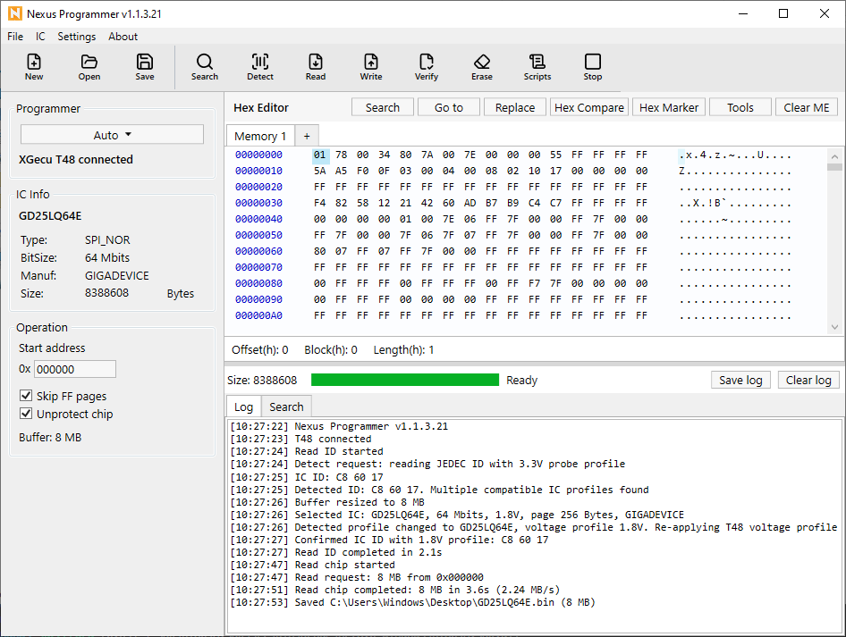

# Nexus Programmer

## English

English | [Tiếng Việt](#tiếng-việt)

Flashing BIOS application for CH341, CH347, XGecu T48, RT809F and RT809H

## Features

- Supports CH341, CH347, XGecu T48, RT809F and RT809H programmers
- Automatic programmer detection, IC detection, IC catalog search and custom IC entries
- Hex-format buffer preview and editing
- Multiple Memory tabs for comparing, editing, merging, splitting and saving BIOS images
- Read, write, verify, erase, blank check and operation cancellation
- Script toolbar for Read + Verify and Erase + Write + Verify workflows
- Windows OEM key search from BIOS buffers
- BIOS tools: Merge BIOS and Split BIOS from toolbar menu or hex editor context menu
- Intel Clear ME helper, ME Region/FIT suggestions, optional retry across candidates and manual ME replacement fallback
- Theme support: Default, Arcade, Heritage, Violet and Matcha

ME Region and FIT are not distributed with this project. You must prepare them yourself, or download here 👉 [ME Region & FIT](https://drive.google.com/drive/folders/1ocp61oICeFGZuf-J59gpnLO88XGzKvPY?usp=sharing)

## Requirements

- Windows 10/11
- .NET 8
- CH341/CH347 Driver: [DriverCH341+CH347.zip](Drivers/DriverCH341+CH347.zip)
- XGecu T48 Driver: [DriverXGecuT48.zip](Drivers/DriverXGecuT48.zip)
- RT809F Driver: [DriverRT809F.zip](Drivers/DriverRT809F.zip)
- RT809H Driver: [DriverRT809H.zip](Drivers/DriverRT809H.zip)

## SDKs

This repository includes experimental .NET hardware SDKs which can be used
outside the WPF application:

- [XGecu T48 SDK](https://github.com/mhqb365/T48.SDK): WinUSB-based SPI25 support for device
  discovery, JEDEC ID, read, blank check, erase, write, sparse write, transfer
  logging and protocol experiments
- [RT809F SDK](https://github.com/mhqb365/RT809F.SDK): FTDI D2XX-based SPI-NOR support for
  discovery, JEDEC ID, read, blank check, erase, batched page program, verify,
  progress, cancellation and deterministic cleanup
- [RT809H SDK](https://github.com/mhqb365/RT809H.SDK): FTDI D2XX-based SPI-NOR support using
  RT809H-specific initialization captured from vendor workflows

These SDKs are unofficial community projects and are not endorsed by the device
vendors. Treat erase and write operations as destructive and test new
integrations with sacrificial flash chips

## Download

You can download the latest release from the [Releases page](https://github.com/mhqb365/NexusProgrammer/releases)

## Shortcuts

- Ctrl + Shift + N: Open a new application window
- Ctrl + N: Create a new ROM buffer
- Ctrl + O: Open a ROM file
- Ctrl + S: Save a ROM file
- Ctrl + G: Go to offset
- Ctrl + F: Search
- Ctrl + H: Replace
- Ctrl + Q: Exit the application

## License

MIT License

Parts of the CH341/CH347 SPI NOR chip catalog are generated from flashrom chip definitions and remain subject to the flashrom GPL-2.0-or-later license

See `THIRD_PARTY_NOTICES.md` and `flashrom-data/COPYING.rst` for more information

## Tiếng Việt

[English](#english) | Tiếng Việt

Ứng dụng nạp BIOS cho CH341, CH347, XGecu T48, RT809F và RT809H

## Tính năng

- Hỗ trợ máy nạp CH341, CH347, XGecu T48, RT809F và RT809H
- Tự động nhận dạng máy nạp, nhận dạng IC, tìm kiếm catalog IC và thêm IC tùy chỉnh
- Xem trước và chỉnh sửa buffer dạng hex
- Nhiều tab Memory để so sánh, chỉnh sửa, merge, split và lưu nhiều BIOS
- Đọc, ghi, verify, xóa, blank check và hủy thao tác
- Nút Scripts trên toolbar cho workflow Read + Verify và Erase + Write + Verify
- Tìm Windows OEM key trong buffer BIOS
- Công cụ BIOS: Merge BIOS và Split BIOS từ menu toolbar hoặc context menu của hex editor
- Hỗ trợ Clear ME Intel BIOS, tự đề xuất ME Region/FIT, tùy chọn retry toàn bộ candidate và fallback thay ME thủ công
- Hỗ trợ giao diện Default, Arcade, Heritage, Violet và Matcha

ME Region và FIT không được phân phối kèm theo dự án này. Bạn phải chuẩn bị chúng hoặc tải về từ đây 👉 [ME Region & FIT](https://drive.google.com/drive/folders/1ocp61oICeFGZuf-J59gpnLO88XGzKvPY?usp=sharing)

## Yêu cầu

- Windows 10/11
- .NET 8
- Driver CH341/CH347: [DriverCH341+CH347.zip](Drivers/DriverCH341+CH347.zip)
- Driver XGecu T48: [DriverXGecuT48.zip](Drivers/DriverXGecuT48.zip)
- Driver RT809F: [DriverRT809F.zip](Drivers/DriverRT809F.zip)
- Driver RT809H: [DriverRT809H.zip](Drivers/DriverRT809H.zip)

## SDK

Repository này có kèm các SDK phần cứng .NET thử nghiệm, có thể dùng độc lập
với ứng dụng WPF:

- [XGecu T48 SDK](https://github.com/mhqb365/T48.SDK): hỗ trợ SPI25 qua WinUSB, gồm nhận dạng
  thiết bị, JEDEC ID, đọc, blank check, xóa, ghi, sparse write, log transfer và
  thử nghiệm protocol
- [RT809F SDK](https://github.com/mhqb365/RT809F.SDK): hỗ trợ SPI-NOR qua FTDI D2XX, gồm nhận
  dạng thiết bị, JEDEC ID, đọc, blank check, xóa, ghi theo batch, verify, tiến
  trình, hủy thao tác và cleanup ổn định
- [RT809H SDK](https://github.com/mhqb365/RT809H.SDK): hỗ trợ SPI-NOR qua FTDI D2XX với chuỗi
  khởi tạo riêng của RT809H được phân tích từ workflow của phần mềm hãng

Các SDK này là dự án cộng đồng không chính thức và không được nhà sản xuất thiết
bị xác nhận hay bảo trợ. Thao tác xóa và ghi có thể phá hủy dữ liệu trên chip,
hãy thử nghiệm tích hợp mới bằng chip thử trước

## Tải về

Bạn có thể tải bản phát hành mới nhất tại [trang Releases](https://github.com/mhqb365/NexusProgrammer/releases)

## Phím tắt

- Ctrl + Shift + N: Mở cửa sổ ứng dụng mới
- Ctrl + N: Tạo buffer ROM mới
- Ctrl + O: Mở file ROM
- Ctrl + S: Lưu file ROM
- Ctrl + G: Nhảy đến offset
- Ctrl + F: Tìm kiếm
- Ctrl + H: Thay thế
- Ctrl + Q: Thoát ứng dụng

## Giấy phép

MIT License

Một số phần trong danh sách IC SPI NOR của CH341/CH347 được tạo từ định nghĩa chip của flashrom và vẫn tuân theo giấy phép flashrom GPL-2.0-or-later

Xem `THIRD_PARTY_NOTICES.md` và `flashrom-data/COPYING.rst` để biết thêm thông tin
